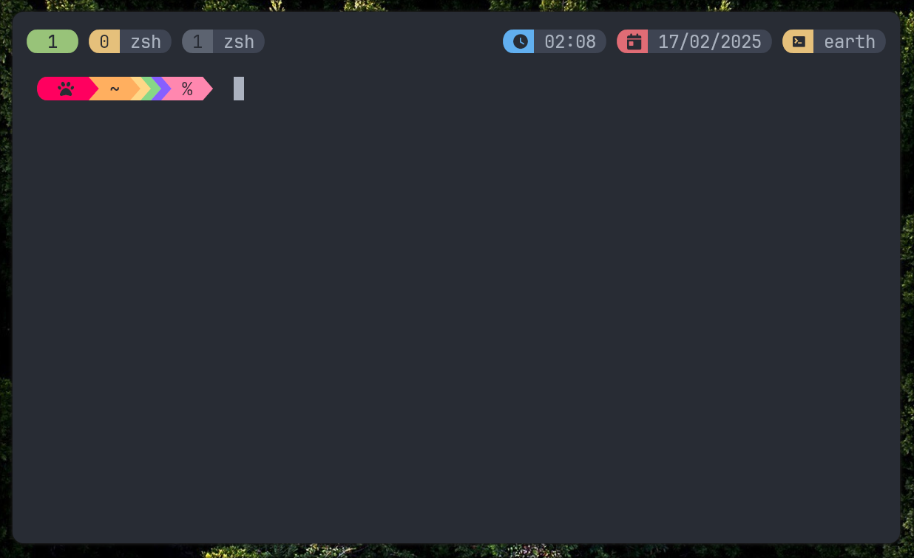

# tmux-onedark-theme
A dark tmux color scheme for terminal that support [True Color](https://en.wikipedia.org/wiki/Color_depth#True_color_.2824-bit.29), based on [onedark.vim](https://github.com/joshdick/onedark.vim), which is inspired by [One Dark syntax theme](https://github.com/atom/one-dark-syntax) for the [Atom text editor](https://atom.io).


### Preview




### Installation
Make sure to have [Tmux Plugin Manager](https://github.com/tmux-plugins/tpm) installed.

in your `.tmux.conf` add the following line:
```bash
set -g @plugin 'nautilor/tmux-onedark-theme'
```

then press `prefix` + `I` to install the plugin.


### License

[MIT](LICENSE)
