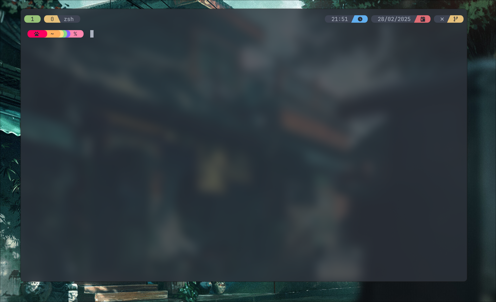
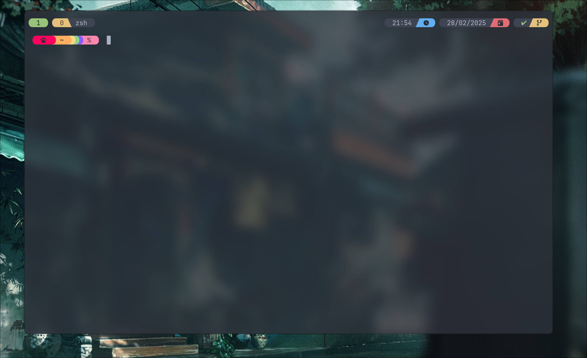
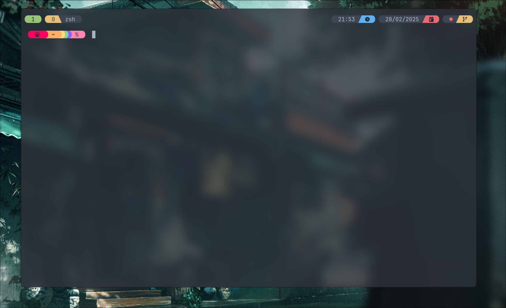
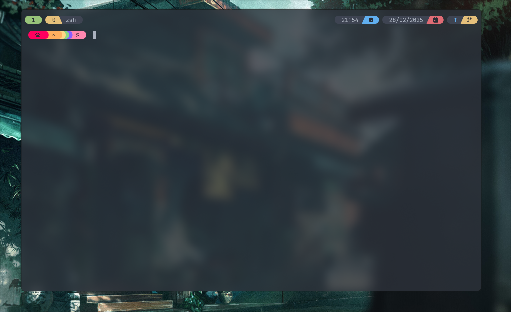

# tmux-onedark-theme


My modified [odedlaz tmux theme](https://github.com/odedlaz/tmux-onedark-theme)

## Installation

- Install [tpm](https://github.com/tmux-plugins/tpm)
- Add this line to your `.tmux.conf`:
```tmux
set -g @plugin 'odedlaz/tmux-onedark-theme'
```

- Reload tmux configuration with `tmux source-file ~/.tmux.conf`

- Install the plugin with `prefix + I`

# IMPORTANT NOTE

- Copy `gitty` script to your path (I.E. `~/.local/bin`) and make it executable
> The script is used to display not pushed commits and untracked files in the status line


## Screenshots

### Not a repo


### Clean repo


### Untracked files


### Unpushed commits


### Both mentioned above


## License

This project is licensed under the MIT License - see the [LICENSE](LICENSE) file for details
